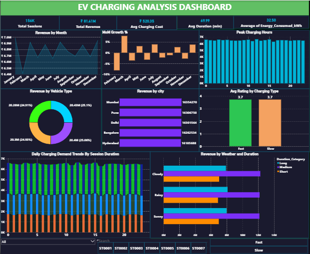

# EV Charging Station Analysis
Python · SQL Server · Power BI · End-to-End Analytics Pipeline

---

## Overview

India's EV infrastructure is growing fast, but most operators don't have a clear picture of where demand is concentrated, which stations are underperforming, or what's driving revenue gaps month to month. This project analyzes 156,455 charging sessions across 200 stations in 5 cities to answer those questions — covering revenue patterns, energy consumption, peak demand, and station-level performance.

**Tech stack:**
- Python — data cleaning, feature engineering, correlation analysis
- SQL Server (SSMS) — business intelligence queries
- Power BI — executive dashboard reporting

---

## How it works
```
Raw Dataset (156,455 records | 17 features)
        ↓
Python (EDA + Feature Engineering + Correlation)
        ↓
SQL Server (CTEs, LAG, RANK, Aggregations)
        ↓
Power BI (Interactive Executive Dashboard)
```

---

## Dataset

| Metric | Value |
|--------|-------|
| Total sessions | 156,455 |
| Total revenue | ₹8.14 Crore |
| Avg session cost | ₹520.35 |
| Avg energy consumed | 32.50 kWh |
| Avg session duration | ~70 minutes |
| Total energy delivered | 5,084,268 kWh |
| Cities covered | 5 (Mumbai, Pune, Delhi, Bangalore, Hyderabad) |
| Charging stations | 200 |
| Vehicle types | 4 (2-Wheeler, 3-Wheeler, 4-Wheeler, Commercial EV) |
| Weather conditions | 3 (Sunny, Cloudy, Rainy) |
| Time period | 12 months |

---

## Analysis

**Feature engineering**
- Extracted charging hour from timestamps — peak demand falls at 12PM (6,666 sessions)
- Created month and season features — 8.8% revenue gap between best month (January ₹69.8L) and worst (February ₹64.1L)
- Built revenue per kWh aggregations — confirmed energy consumption as the primary revenue driver
- Categorized session durations — Short (40,143) / Medium (70,153) / Long (46,159)

**Correlation analysis**
- Strong positive correlation: energy consumed vs charging cost — confirms energy as the main revenue variable
- Positive correlation: charging duration vs energy consumption
- Fast vs slow charger avg cost: ₹522.65 vs ₹518.05 — only ₹4.60 gap despite similar ~70 min sessions

**SQL business intelligence queries**

| Query | Technique | Finding |
|-------|-----------|---------|
| Month-over-month revenue growth | LAG window function | 8.8% seasonal revenue gap |
| Top vehicle types per month | RANK + PARTITION BY | 2-Wheeler leads at ₹2.04Cr (25.1%) |
| Station performance benchmarking | Subquery + HAVING | ST0091 tops at ₹4.49L vs ₹4.07L avg |
| Peak hour demand analysis | GROUP BY + ORDER BY | 12PM peak — 6,666 sessions |
| Energy consumption by vehicle | HAVING + subquery | Commercial EV is highest energy consumer |

---

## Power BI dashboard

KPIs tracked: total sessions (156K), total revenue (₹8.14Cr), avg charging cost (₹520), avg duration (70 mins), avg energy (32.50 kWh)

Visuals included:
- Revenue by month (MoM trend)
- Revenue by vehicle type
- Peak charging hours distribution
- Station performance benchmarking
- City-wise revenue breakdown
- Revenue by weather condition and duration category
- Interactive slicers — City, Vehicle Type, Charger Type, Weather

---

## Key findings

| Finding | Numbers | Action |
|---------|---------|--------|
| Peak demand at 12PM | 6,666 sessions | Prioritize station availability at noon |
| ST0091 top performer | 10.5% above network avg revenue | Worth replicating across other stations |
| February lowest month | ₹64.1L vs January ₹69.8L | Promotional pricing could close the gap |
| Fast vs slow charger gap | Only ₹4.60 difference in avg cost | Fast charger pricing needs rethinking |
| 2-Wheeler segment | 25.1% of total revenue (₹2.04Cr) | Strongest segment for infrastructure investment |

---

## File structure
```
EV-Charging-Station-Analysis/
├── ev_charging.ipynb
├── ev_charg.sql
├── ev_charging_station_analyticss_dashboard.pbix
├── EV_Charging_Cleaned.csv
└── EV_Charging_Station_Analytics_Dashboard.PNG
```

---

## How to run

1. Run `ev_charging.ipynb` to walk through data cleaning, feature engineering, and correlation analysis
2. Import `ev_charg.sql` into SQL Server Management Studio (SSMS) to run the business intelligence queries
3. Open `ev_charging_station_analyticss_dashboard.pbix` in Power BI Desktop to explore the dashboard

---

## Dashboard preview



---

## Conclusions

The energy consumption finding is the most straightforward — the more kWh delivered, the more revenue generated. That's expected. What's less obvious is what to do with the fast charger pricing gap.

Fast and slow chargers both average around 70 minutes per session, but fast chargers only pull ₹4.60 more on average. If fast chargers cost more to install and maintain, that margin is almost certainly not covering the difference. That's probably the highest-leverage pricing decision in the dataset.

Station ST0091 running 10.5% above the network average is worth investigating separately. The dashboard doesn't explain why — it could be location, charger mix, or something operational — but it's the clearest signal of what good looks like across 200 stations.

The 12PM peak is clean and consistent. 6,666 sessions in a single hour window means capacity planning around midday is not optional, it's the baseline.
